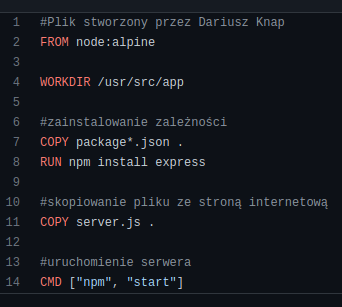
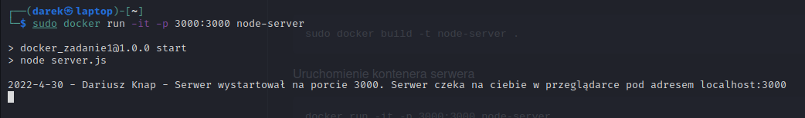
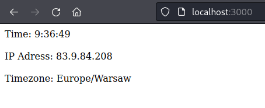
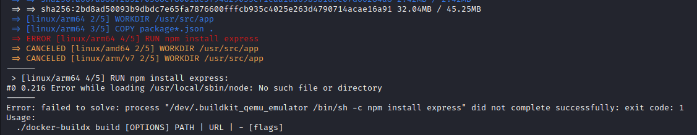

# zadanie1
Prosta aplikacja stworzona z pomocą technologii node js i express js prezentująca ip i czas lokalny klienta .

Plik dockerfile: <br></br>


Zbudowanie kontenera serwera
```
sudo docker build -t node-server .
```
Uruchomienie kontenera serwera
```
docker run -it -p 3000:3000 node-server
```
Po uruchomieniu kontener powinien zwróci w konsoli wiadomość na jakim porcie oczekuje na nas.
Można zobaczyć tę wiadomość za pomocą polecenia <i>docker logs \<id-kontenera-serwera\></i>
<br></br>


  
<br></br>
By sprawdzić ile warstw posiada kontener należy użyć polecenia 
```
docker history <id-obrazu>
```
W celu zbudowania obrazu na wiele architektur użyłem poleceń:

Wybór buildera do budowania obrazów wieloarchitekturowych
```
docker buildx use multiarchbuilder
```
Następnie należy zainstalować emulator qemu i zbudować obrazy. Bez emulatora budowanie obrazów skończy się następująćym błędem:
<br></br>

```
docker run --rm --privileged multiarch/qemu-user-static --reset -p yes
docker buildx build -t dariuszknap1/zadanie:first --platform linux/arm/v7,linux/arm64/v8,linux/amd64 --push .   
```

